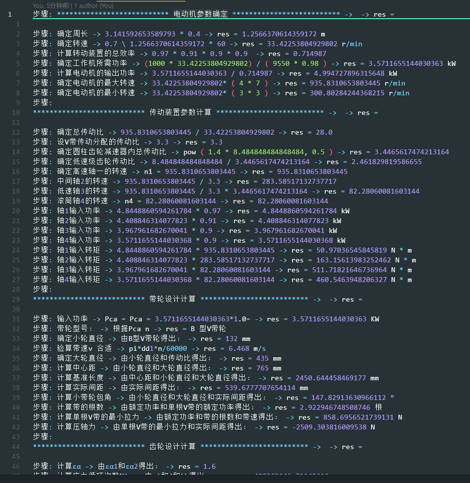

# 机械设计课设计算器
> 一个机械设计课设的计算器，可以计算出包括电动机，传动装置，V带轮，齿轮，轴，轴承的几何或者力，运动学参数数值。

- [机械设计课设计算器](#机械设计课设计算器)
  - [快速开始](#快速开始)
    - [安装](#安装)
    - [运行](#运行)
    - [参数设置](#参数设置)
      - [运输机参数](#运输机参数)
      - [带轮参数](#带轮参数)
      - [齿轮系数](#齿轮系数)
      - [轴系数](#轴系数)
      - [轴系数](#轴系数-1)
  - [例子](#例子)

## 快速开始

### 安装
首先使用 git 克隆源代码。  
命令：  
```
git clone https://github.com/SongZihui-sudo/Mechanical-design-solver.git
```

这个计算器是一个 python 脚本，所以你需要 python 来运行它，如果你没有安装python请先在 [python官网](https://www.python.org/) 安装 python 。  
本项目使用了 sympy 来进行代数运算，所以还需安装第三方库 sympy  
控制台输入命令：  
```
pip install sympy
```  
安装完成

### 运行
命令：  
```
进入文件夹
cd Mechanical-design-solver

修改 config.py 进行配置，详细配置说明在下面

运行脚本
pyhon main.py
```

### 参数设置

#### 运输机参数
```python
config["T"]: int = 1000         # 运输机工作轴转矩
config["v"]: float = 0.70       # 运输带工作速度
config["D"]: float = 0.4        # 滚筒直径
config["etaw"]: float = 0.98    # 工作机的效率
config["ld"]: float = 2000      # 运输机的传动长度
config["q"] = 0.1  # 单位长度质量
config["each_eta"]: list = [0.97, 0.91, 0.9, 0.9]  # 传动部分各级的效率
config["Range_transmission_ratio"]: list = [    # 传动比范围
    [3, 4],
    [3, 7]
]
config["i1"]: float = 3.3   # v带轮传动比范围
```

#### 带轮参数
选取各种系数
```python
config["Ka"]: float = 1.0   # 工作情况系数
config["P0"]: float = 1.67  # 单根V带的额定功率
config["dP0"]: float = 0.169  # 单根V带的额定功率增量
config["ka"]: float = 0.92  # 小带轮的包角修正系数
config["kl"]: float = 1.01  # 带长修正系数
config["V-Type"]: str = "B"  # V带类型 ** 需要根据实际情况，自行选取 **
# V带选型数据
config["type_linear_coefficient"]: dict = {
    "A": {
        "type": "A",
        "range": [80, 100]
    },
    "B": {
        "type": "B",
        "range": [125, 140]
    },
    "C": {
        "type": "C",
        "range": [200, 315]
    },
    "D": {
        "type": "D",
        "range": [355, 400]
    },
    "E": {
        "type": "E",
        "range": [455, 500]
    },
    "Z": {
        "type": "Z",
        "range": [50, 71]
    }
}
```

#### 齿轮系数
选取各种系数
```python
config["z1"]: int = 100  # 大齿轮齿数缺省值
config["z2"]: int = 20   # 小齿轮齿数缺省值
config["beta"]: float = 15  # 螺旋角缺省值
config["Kt"]: float = 1.5  # 载荷系数缺省值
config["ZH"]: float = 2.433  # 区域系数缺省值
config["varphi_d"]: float = 1  # 齿宽系数缺省值
config["εα1"]: float = 0.7  # εα1缺省值
config["εα2"]: float = 0.9  # εα2缺省值
config["ZE"]: float = 180  # 弹性影响系数缺省值
config["σHlim1"]: float = 610  # 小齿轮的接触疲劳强度极限
config["σHlim2"]: float = 570  # 大齿轮的接触疲劳强度极限
config["j"]: int = 1  # 齿轮转一周时同侧齿面的啮合次数
config["Lh"]: int = 2 * 8 * 300 * 5  # 齿轮的寿命
config["KHN1"]: float = 0.95  # 大齿轮的接触疲劳寿命系数
config["KHN2"]: float = 0.97  # 小齿轮的接触疲劳寿命系数
config["u"]: int = 5
config["KA"]: float = 1
config["KV"]: float = 1.11
config["KHβ"]: float = 1.36
config["KHα"]: float = 1.40
config["KFα"]: float = 1.40
config["KFβ"]: float = 1.36
config["Yβ"]: float = 0.88  # 螺旋角影响系数
# 齿型系数
config["YFa1"]: float = 2.724
config["Yfa2"]: float = 2.172
# 应力校正系数
config["Ysa1"]: float = 1.569
config["Ysa2"]: float = 1.798
config["KFN1"]: float = 0.95
config["KFN2"]: float = 0.98
# 设 [σF]
config["σF1"]: float = 500
config["σF2"]: float = 380
```
#### 轴系数
需要自行根据实际情况选取,以高速轴为例
```python
# ZL1 联轴器
config["High-speed-shift"]: dict = {}
config["High-speed-shift"]["a"]: float = 14     # a 尺寸 齿轮距离箱体内壁距离
config["High-speed-shift"]["c"]: float = 12.5   # c
config["High-speed-shift"]["s"]: float = 12     # 箱体内壁的一段距离
config["High-speed-shift"]["bear"]: list = [17, 40, 12]  # 30203 圆锥滚子轴承
config["High-speed-shift"]["A0"]: float = 112  # A0 尺寸
config["High-speed-shift"]["KA"]: float = 1.3  # 使用系数
config["High-speed-shift"]["L1-2"]: float = 28  # l1-2 尺寸
config["High-speed-shift"]["L2-3"]: float = 40  # l2-3 尺寸
config["High-speed-shift"]["L3-4"]: float = 47
config["High-speed-shift"]["L4-5"]: float = config["High-speed-shift"]["a"] + \
    config["High-speed-shift"]["s"] + \
    config["High-speed-shift"]["bear"][0] + 50  # l4-5 尺寸
config["High-speed-shift"]["L5-6"]: float = 12  # l5-6 尺寸
config["High-speed-shift"]["L6-7"]: float = 46  # l6-7 尺寸
config["High-speed-shift"]["L7-8"]: float = 60  # l7-8 尺寸
config["High-speed-shift"]["D1-2"]: float = 14  # d1-2 尺寸
config["High-speed-shift"]["D2-3"]: float = 16  # d2-3 尺寸
config["High-speed-shift"]["D3-4"]: float = 18  # d3-4 尺寸
config["High-speed-shift"]["D4-5"]: float = 22  # d4-5 尺寸
config["High-speed-shift"]["D5-6"]: float = 24  # d5-6 尺寸
config["High-speed-shift"]["D6-7"]: float = 26  # d6-7 尺寸
config["High-speed-shift"]["D7-8"]: float = 17  # d7-8 尺寸
config["High-speed-shift"]["Dquan"]: float = 25     # 挡圈直径
config["High-speed-shift"]["lduan"]: float = 30    # 挡圈长度
config["High-speed-shift"]["alpha"] = 20    # 角
config["High-speed-shift"]["L"] = 32    # 联轴器长度
config["High-speed-shift"]["L1"] = 27   # 半联轴器长度
config["High-speed-shift"]["L2"] = 37   # 根据轴承查表
config["High-speed-shift"]["L3"] = 22   # 根据轴承查表
config["High-speed-shift"]["d1"] = 12              # 联轴器 d1
config["High-speed-shift"]["h"] = 2.5           # 轴肩 h
```

#### 轴系数
选取一些系数
```python
config["High-speed-bear"]: dict = {}
config["High-speed-bear"]["Y"]: float = 2.5  # 轴向动载荷系数
config["High-speed-bear"]["e"]: float = 0.3  # 判断系数
config["High-speed-bear"]["C"]: float = 44800  # 基本额定动载荷
config["High-speed-bear"]["C0"]: float = 30000  # 基本额定静载荷系数
config["High-speed-bear"]["fp"]: float = 1.2
```

## 例子
同目录 计算结果.txt 为一个计算结果的例子。  

**截图**
   
   
结果很长，没有一一列举
